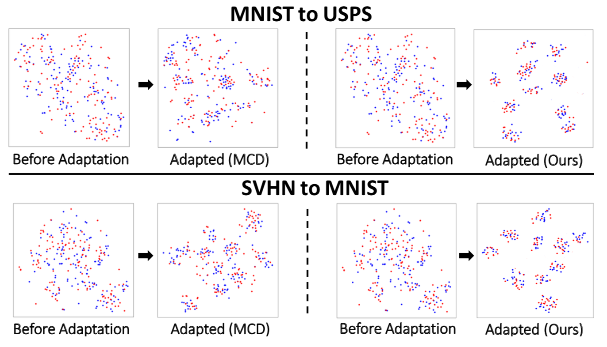

# Discriminative Feature Alignment for Digit Classification
##### A prior-guided latent alignment approach for Unsupervised Domain Adaptation

This is the code implementation of Discriminative Feature Alignment for digit and object classification in Pytorch. The code is implemented by Jing Wang.

The t-SNE visualization of our method is shown below



# Results

| Method  | SVHN-MNIST | SYNSIGNS-GTSRB | MNIST-USPS | USPS-MNIST |
| ------------- | ------------- | ------------- | ------------- |------------- |
| MCD  | 96.2  | 94.4 | 96.5 | 94.1 |
| DFA-ENT (***Ours***)  | 98.2 | 96.8 | 97.9 | 96.2 |
| DFA-MCD (***Ours***)  | 98.9 | 97.5 | 98.6 | 96.6 |

# Getting Started

#### Installation

* Install PyTorch and its dependencies ```pip install torch torchvision```
* Install torchnet ```pip install git+https://github.com/pytorch/tnt.git@master```

# One Suggestion

Our framework is developed based on MCD. We want to make sure everything in the code is the same except for DFA when we implemented DFA-MCD. You can compare our code implementation of DFA-MCD with the original implementation of MCD [here](https://github.com/mil-tokyo/MCD_DA/tree/master/classification). You can easily find out how the DFA is incorporated into MCD via such comparison, which will inspire you how to use DFA for your own work.

# Dataset

Download MNIST data from [here](https://drive.google.com/file/d/1cZ4vSIS-IKoyKWPfcgxFMugw0LtMiqPf/view). You can download other datasets from their official websites. Please create a folder named "data" and put the dataset in the directory ./data.

# Train

* Here is an example for running experiment on the adaptation scenario from MNIST to USPS with all training samples are used:

``` python main.py --source mnist --target usps --all_use yes```
