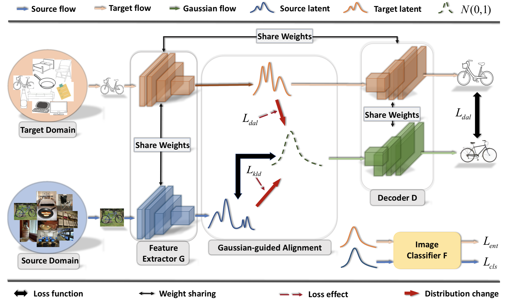

# Discriminative Feature Alignment for Object Classification
##### A prior-guided latent alignment approach for Unsupervised Domain Adaptation

This is the code implementation of Discriminative Feature Alignment for digit and object classification in Pytorch. The code is implemented by Jing Wang.

The framework for the proposed DFA-ENT is shown below:



# Results

### Office-31


| Method  | A-W | D-W | W-D | A-D | D-A | W-A| Avg | 
| ------------- | ------------- | ------------- | ------------- |------------- | ------------- | ------------- |------------- |
| SAFN  | 90.1 | 98.6 | 99.8 | 90.7 | 73.0 | 70.2 | 87.1 |
| DFA-ENT (***Ours***)  | 90.5 | 99.0 | 100.0 | 94.3 | 72.1 | 67.8 | 87.3 |
| DFA-SAFN (***Ours***)  | 93.5 | 99.4 | 100.0 | 94.8 | 73.8 | 71.0 | 88.8 |


### ImageCLEF-DA

| Method  | I-P | P-I | I-C | C-I | C-P | P-C| Avg | 
| ------------- | ------------- | ------------- | ------------- |------------- | ------------- | ------------- |------------- |
| SAFN  | 79.3 | 93.3 | 96.3 | 91.7 | 77.6 | 95.3 | 88.9 |
| DFA-ENT (***Ours***)  | 79.5 | 93.0 | 96.4 | 92.5 | 77.2 | 95.8 | 89.1 |
| DFA-SAFN (***Ours***)  | 80.0 | 94.2 | 97.5 | 93.8 | 78.7 | 96.7 | 90.2 |


### Office-HOME

| Method  | Ar-Cl | Ar-Pr | Ar-Rw | Cl-Ar | Cl-Pr | Cl-Rw | Pr-Ar| Pr-Cl | Pr-Rw | Rw-Ar | Rw-Cl | Rw-Pr | Avg | 
| ------------- | ------------- | ------------- | ------------- |------------- | ------------- | ------------- |------------- |------------- | ------------- |------------- | ------------- | ------------- |------------- |
| SAFN  | 52.0 | 71.7 | 76.3 | 64.2 | 69.9 | 71.9 | 63.7 | 51.4 | 77.1 | 70.9 | 57.1 | 81.5 | 67.3 |
| DFA-ENT (***Ours***)  | 79.5 | 93.0 | 96.4 | 92.5 | 77.2 | 95.8 | 89.1 |
| DFA-SAFN (***Ours***)  | 80.0 | 94.2 | 97.5 | 93.8 | 78.7 | 96.7 | 90.2 |


# Getting Started

#### Installation

* Install PyTorch and its dependencies ```pip install torch torchvision```
* Install torchnet ```pip install git+https://github.com/pytorch/tnt.git@master```

# Dataset

Please download dataset from its official website. Please the dataset in the directory ./data.

# Train

* Here is an example for running experiment on the adaptation scenario from SVHN to MNIST:

``` python main.py --source svhn --target mnist```
