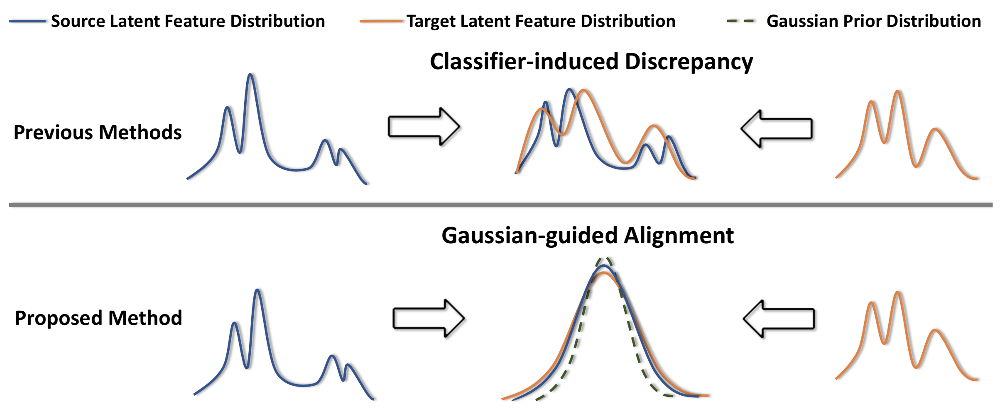

# Discriminative Feature Alignment
##### A prior-guided latent alignment approach for Unsupervised Domain Adaptation



This is the code implementation of Discriminative Feature Alignment for digit and object classification in Pytorch. The code is implemented by Jing Wang.

Paper Name: Discriminative Feature Alginment: Improving Transferability of Unsupervised Domain Adaptation by Gaussian-guided Latent Alignment: [link to Paper](https://arxiv.org/abs/2006.12770)


# Citation

Please cite our paper if you use the code for your work.
```
@article{jing2020discriminative,
  title={Discriminative Feature Alginment: Improving Transferability of Unsupervised Domain Adaptation by Gaussian-guided Latent Alignment},
  author={Wang, Jing and Chen, Jiahong and Lin, Jianzhe and Sigal, Leonid and de Silva, W. Clarence},
  journal={arXiv preprint arXiv:2006.12770},
  year={2020}
}
```

