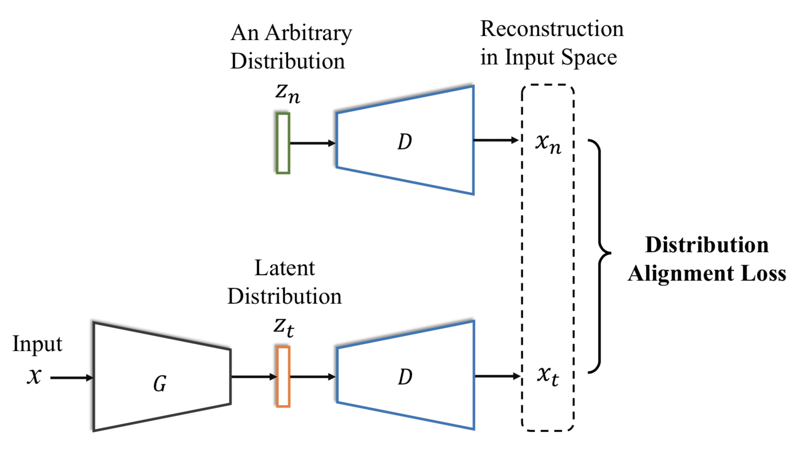

# Discriminative Feature Alignment
##### A prior-guided latent alignment approach for Unsupervised Domain Adaptation


This is the code implementation of Discriminative Feature Alignment for digit and object classification in Pytorch. The code is implemented by Jing Wang.

Paper Name: Discriminative Feature Alginment: Improving Transferability of Unsupervised Domain Adaptation by Gaussian-guided Latent Alignment [[link to Paper]](https://arxiv.org/abs/2006.12770)

One of the key contribution of this paper is introducing a new method to align any two distributions, which is GAN explored. Instead of optimizing the discriminator error, it minimizes the direct L1-distance between the decoded samples in the feature space.



Below are the results that can validate the distribution alignment mechanism of our proposed regularization:


# Instructions

### The instructions for each experiment is inside the directories ***Digit_Classification*** and  ***Object_Classification***. 


# Citation

Please cite our paper if you use the code for your work.
```
@article{jing2020discriminative,
  title={Discriminative Feature Alginment: Improving Transferability of Unsupervised Domain Adaptation by Gaussian-guided Latent Alignment},
  author={Wang, Jing and Chen, Jiahong and Lin, Jianzhe and Sigal, Leonid and de Silva, W. Clarence},
  journal={arXiv preprint arXiv:2006.12770},
  year={2020}
}
```

# References

[MCD_DA](https://github.com/mil-tokyo/MCD_DA)

[AFN](https://github.com/jihanyang/AFN)
